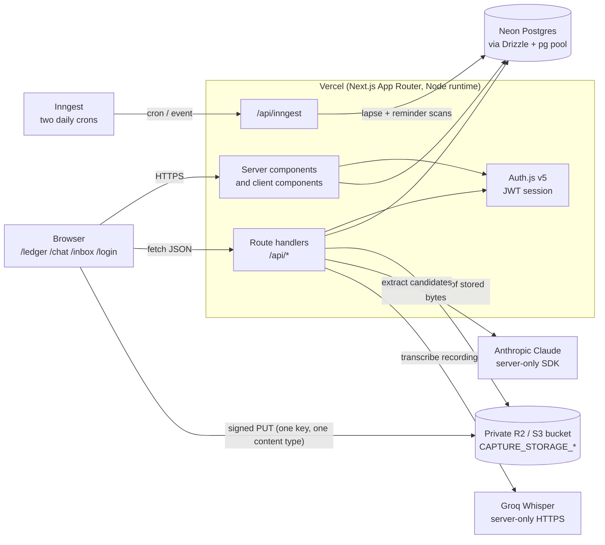
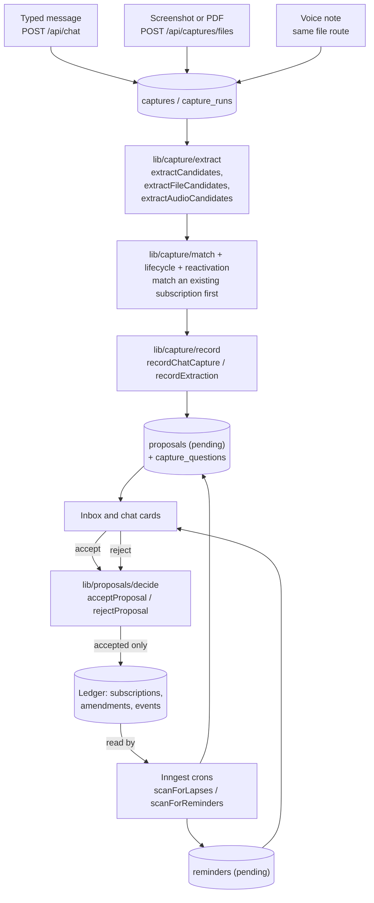
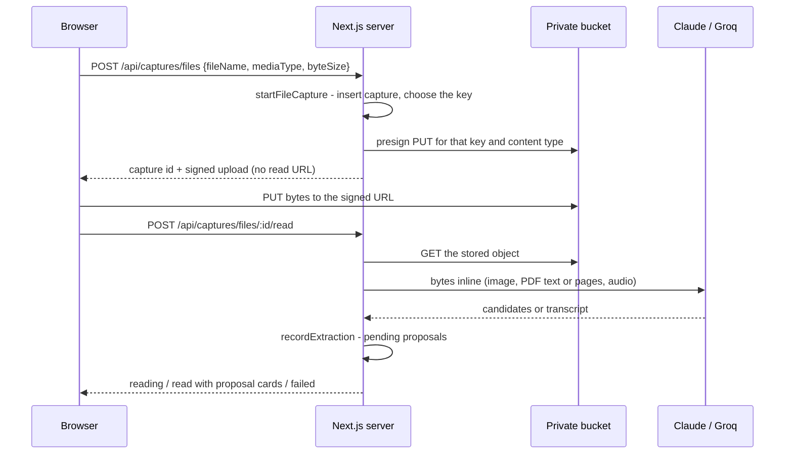
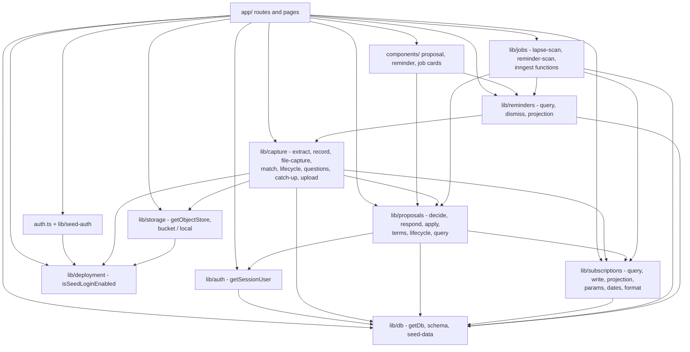

# System map (web-cloud)

How the shipped system is wired. This page is
descriptive: product rules live in [product.md](product.md) and
[AGENTS.md](../AGENTS.md), tables in [data-model.md](data-model.md), and it
does not restate them.

The product records **holdings, cost, and next due**, not payments. A receipt
updates those three; it is not a transaction to store. Capture does not write
payments. There is no `charges` table. List, detail, and the timeline do not
show charge lines. A `charged` proposal, if one is accepted, applies terms, not
a payment. Do not infer `cancelled` from silence or a passed `next_renewal` —
a holding row's stored past date is **overdue**, not a lifecycle change, and
there is no `lapsed` status. **No scan is product behavior.** The intended
system runs no unattended job against `next_renewal`: an overdue row keeps its
stored date until the user says still-holding (rolls it by cadence, `inferred`)
or cancelled. Catch-up is an Inbox section, not a chat greeting.

**Code still has the reminder scan and the lapse scan** (`lib/jobs/lapse-scan.ts`,
`lib/jobs/reminder-scan.ts`, the two daily Inngest crons below, and chat's
still-holding greeting in `lib/capture/catch-up.ts`). Later child issues remove
them; this document describes the intended end state above and the current
wiring below so the two do not get confused.

Three things hold everything else together:

- The ledger UI is a **projection** of `subscriptions` + `amendments` +
  `events`, never a second source of truth.
- **Captures** (raw input) and **proposals** (suggestions) are separate stores.
  Nothing reaches the ledger until a proposal is accepted.
- Per `AGENTS.md`: "Do not auto-confirm `amount`, `cadence`, or
  `next_renewal`." Extraction and the nightly scans write `proposed` or
  `inferred` fields and pending proposals only; a user action is what sets
  `confirmed`.

## Runtime context

The browser never reads stored objects: uploads are signed for a write to one
key, and reads happen on the server, which passes the bytes to Claude or Groq
inline. Vendor keys exist only in the server environment.

## Capture → proposal → ledger

There is no edge from extraction to the ledger. A rejected proposal records the
decision and leaves the ledger alone; a reminder writes no subscription column
at all.

### Signed upload, then read

## Internal modules

`app/` holds routes and UI; every rule and query lives in `lib/`. Route
handlers do three things: resolve the session user, parse the body with Zod, and
call one `lib/` entrypoint.

| Surface | `lib/` packages | Entrypoints |
|---|---|---|
| `/login`, `auth.ts` | `deployment`, `seed-auth` | `isSeedLoginEnabled`, `verifySeedCredentials` |
| `/ledger`, `/ledger/[id]` | `auth`, `db`, `subscriptions` | `getSessionUser`, `listSubscriptions`, `getSubscriptionDetail`, `timelineEntries`, `format` |
| `/ledger/new`, `/ledger/[id]/edit` | `subscriptions` | `toSubscriptionFormValues`, `parseCreateBody`, `parseUpdateBody` |
| `/chat` | `capture`, `proposals` | `ensureStillHoldingQuestion`, `parseChatMessageBody`, `parseFileCaptureBody`, `toProposalView`, `parseAcceptBody` |
| `/inbox` | `proposals`, `reminders`, `deployment` | `toProposalView`, `toReminderView`, `isSeedLoginEnabled` |
| `GET /api/subscriptions`, `/summary`, `/:id` | `auth`, `db`, `subscriptions` | `parseListQuery`, `listSubscriptions`, `getSummary`, `getSubscriptionDetail` |
| `POST /api/subscriptions`, `PATCH /api/subscriptions/:id` | `auth`, `db`, `subscriptions` | `createSubscription`, `updateSubscription` |
| `GET /api/chat` | `auth`, `db`, `capture` | `ensureStillHoldingQuestion` |
| `POST /api/chat` | `auth`, `db`, `capture` | `extractCandidates`, `recordChatCapture`, `recordCancelTimingAnswer`, `recordIdentityAnswer`, `recordStillHoldingAnswer`, `recordChatDeferral` |
| `POST /api/captures/files`, `/:id/read` | `auth`, `db`, `capture`, `storage` | `startFileCapture`, `readFileCapture`, `getObjectStore` |
| `PUT /api/captures/upload` | `auth`, `capture`, `storage` | `getObjectStore` (development disk store only) |
| `GET /api/proposals` | `auth`, `db`, `proposals` | `parseProposalQuery`, `listProposals` |
| `POST /api/proposals/:id/accept`, `/reject` | `proposals` | `respondToProposal` → `acceptProposal` / `rejectProposal` |
| `GET /api/reminders`, `POST /api/reminders/:id/dismiss` | `auth`, `db`, `reminders` | `parseReminderQuery`, `listReminders`, `dismissReminder` |
| `POST /api/jobs/lapse-scan`, `/reminder-scan` | `auth`, `db`, `jobs` | `scanForLapses`, `scanForReminders` |
| `POST /api/inngest` | `jobs` | `jobFunctions`, `inngest` |

### Who imports whom

Direction is stable: `db` and `deployment` are leaves, `subscriptions` owns
ledger reads and writes, `proposals` is the only package that turns a pending
row into a ledger change, and `capture` and `jobs` are producers of proposals
that never write the ledger themselves. `lib/reminders` reaches into
`lib/capture/questions` for the deferred-question rows a reminder quotes.

## Security

- Every `/api/*` route except the Auth.js handler resolves a session first;
  `user_id` comes from the session, never from a request body.
- Every ledger, proposal, capture, and reminder query filters by that
  `user_id`, and another user's row is a 404.
- Vendor keys and bucket credentials are server-only. The bucket is private and
  no read URL is ever minted for the browser.
- The development disk store writes under `.captures` (git-ignored, outside
  `public/`) and only under the caller's own key prefix.

## External dependencies

npm, from `package.json` (Node 20.19, 22.13, or newer LTS):

| Package | Used for |
|---|---|
| `next`, `react`, `react-dom` | App Router pages and route handlers |
| `next-auth` (Auth.js v5) | Session, credentials provider |
| `drizzle-orm`, `pg` | Queries and the Postgres pool |
| `zod` | Every request body, extractor tool output, and job payload |
| `@anthropic-ai/sdk` | Claude extraction from text, images, and PDFs |
| `@aws-sdk/client-s3`, `@aws-sdk/s3-request-presigner` | Signed PUTs and server-side reads of the R2/S3 bucket |
| `pdfjs-dist` | Reading a PDF's own text layer before sending pages |
| `inngest` | Cron and event functions for the two daily scans |
| `tailwindcss`, `@tailwindcss/postcss`, `postcss` | Styling |
| `drizzle-kit`, `tsx`, `dotenv` | Migrations and the seed script |
| `vitest` | Unit and API tests |
| `eslint`, `eslint-config-next`, `typescript` | Lint and typecheck |

Groq's Whisper transcription is a plain `fetch` to
`https://api.groq.com/openai/v1/audio/transcriptions`; it has no SDK dependency.

Hosted services:

| Service | Role | Required for |
|---|---|---|
| Vercel | Hosts the app; `VERCEL_ENV` distinguishes preview from production | Deployment |
| Neon Postgres | The database behind `DATABASE_URL` | Everything |
| Anthropic Claude | Extraction from messages, screenshots, PDFs | `/chat` and file capture |
| Groq Whisper | Transcribing voice notes | Voice notes |
| Cloudflare R2 or any S3-compatible bucket | Private storage for uploads | File and voice capture |
| Inngest | Runs the 07:00 lapse scan and 07:15 reminder scan (Europe/London) | Unattended scans |

### Environment variable names

Names only, as in `.env.example`; no values belong in this repo.

| Variable | Read by |
|---|---|
| `AUTH_SECRET` | Auth.js session signing |
| `SEED_EMAIL`, `SEED_PASSWORD` | `lib/seed-auth`, `lib/db/seed.ts` |
| `DATABASE_URL` | `lib/db`, `drizzle.config.ts`, tests |
| `ANTHROPIC_API_KEY` | `lib/capture/extract` → `lib/capture/anthropic` |
| `GROQ_API_KEY`, `GROQ_TRANSCRIPTION_MODEL` | `lib/capture/transcribe` |
| `CAPTURE_STORAGE_BUCKET`, `CAPTURE_STORAGE_ENDPOINT`, `CAPTURE_STORAGE_REGION`, `CAPTURE_STORAGE_ACCESS_KEY_ID`, `CAPTURE_STORAGE_SECRET_ACCESS_KEY` | `lib/storage/objects` → `lib/storage/bucket` |
| `INNGEST_EVENT_KEY`, `INNGEST_SIGNING_KEY` | The Inngest client behind `/api/inngest` |

The code also reads `NODE_ENV` and `VERCEL_ENV` (`lib/deployment`), and an
optional `ANTHROPIC_MODEL` override documented in the root `README.md`.

### When a key is missing

A missing key never looks like a working product: the fallbacks exist for a
laptop, and a deployed server refuses instead.

| Missing | development / test | preview / production |
|---|---|---|
| `ANTHROPIC_API_KEY` | Labelled fixture extractor: pattern matching over the message, the file name, or a PDF's text layer, and every response says so | `503 extractor_unavailable` from `/api/chat` and the file read, with a message naming the key |
| `GROQ_API_KEY` | No stand-in — a recording cannot be read without listening to it, so the read fails saying the key is missing | Same failure, worded for a server |
| `CAPTURE_STORAGE_*` | Disk store under `.captures`, uploaded through `PUT /api/captures/upload` | `503 storage_unavailable` rather than storing receipts somewhere less private |
| `INNGEST_*` | The two scans are reachable by hand: `POST /api/jobs/lapse-scan`, `POST /api/jobs/reminder-scan`, and the inbox shows both buttons | Same routes still work, but nothing runs at 07:00 or 07:15 |
| `DATABASE_URL` | `getDb()` throws; the API tests skip themselves | The app cannot serve |

## Environments

| | local `development` | test | Preview (Vercel) | Production (Vercel) |
|---|---|---|---|---|
| `NODE_ENV` / `VERCEL_ENV` | `development` / unset | `test` / unset | `production` / `preview` | `production` / `production` |
| Auth | Seed credentials (`SEED_EMAIL`, `SEED_PASSWORD`) | Seed user rows, no browser session | Seed credentials — this is what a human signs in with per PR | Magic-link placeholder; seed login is off |
| Database | `DATABASE_URL` — the Neon `dev` branch, **seeded**. Yours to break; re-branch from `production` when it drifts. This is the one you click through with `npm run dev` | **Never** `DATABASE_URL`. An ephemeral `postgres:16` (`docker-compose.yml`, port 5433) locally, CI's service container, or the sandbox's Postgres in a cloud session. Migrated, **never seeded**, discarded after the run; each API test also runs in a transaction that is rolled back | **Its own Neon branch**, created per pull request by the Neon Postgres Previews integration and deleted when the branch goes. `scripts/build.sh` migrates it and seeds it on every deploy, so each PR is signed off against its own data | The Neon `production` branch, migrated by `scripts/build.sh` when `main` deploys; **never seeded** — this is the real inventory |
| Storage | Bucket if `CAPTURE_STORAGE_*` is set, otherwise `.captures` on disk | No object store is touched; stores are stubbed | Private bucket or `503` | Private bucket |
| Anthropic | Key if you have one, otherwise labelled fixtures | No key; fixtures do the reading | Key required, or capture returns `503` | Key required |
| Groq | Key required to read a voice note | Transcription is stubbed | Key required | Key required |
| Inngest | Not configured; use the inbox buttons or the job routes | Scans are called directly as functions | Optional; the buttons are there | Keys set, so the two crons run |
| Checks | `npm run lint`, `npm run typecheck`, `npm test`, `npm run build`. `pretest` starts and migrates the test container first | GitHub Actions runs lint, typecheck, `db:migrate`, then `npm test` on every PR and on `main`; `pretest` is a no-op there because `CI` is set | — | — |

### Where each deployment's database comes from

`"build": "bash scripts/build.sh"`. Locally that is `next build` and nothing
else — a local build never touches a database. On Vercel it first migrates the
deployment's own database, then seeds it **only** when `VERCEL_ENV=preview`.

A preview's Neon branch is forked from `production`, so it arrives with
production's schema and *not* the pull request's own migration. Running the
migration in the build is what makes a schema-changing PR previewable at all.

Migrations use `DATABASE_URL_UNPOOLED` when it is set. Neon's integration points
`DATABASE_URL` at the pooler, and DDL through a pooler misbehaves.

Seeding runs on every preview deploy. It is idempotent, and re-seeding resets
proposal decisions, so each deploy hands you a fresh reviewable state — pushing
a fix mid-review will reset anything you clicked.

### Why the test database is separate

The integration suites insert their own fixtures using the same fixed ids as
`lib/db/seed-data.ts` (`SEED_USER_ID`, `SEED_SUBSCRIPTION_IDS`). Against a
seeded database each `beforeAll` dies on `users_pkey`, so Vitest reports those
files as **skipped** and `npm test` still exits 0 — a green run that asserted
nothing. `vitest.global-setup.ts` now refuses to start on a seeded database
rather than letting that happen quietly.

The suite therefore chooses its own database and ignores `DATABASE_URL` on a
laptop. Precedence, implemented identically in `vitest.config.ts` and
`scripts/test-db.sh`: `TEST_DATABASE_URL` if set; otherwise `DATABASE_URL` when
`CI` or `CLAUDE_CODE_REMOTE` is set, because those supply their own migrated,
unseeded database; otherwise the Docker container.

Preview is what a human tests per PR, which is why seed login and the scan
buttons exist there and only there. Production is one person's inventory, so
nothing seeds it and no development stand-in runs. Tests use Vitest and must
not need a live vendor key: the extractor, the transcriber, and the object
store are all injectable, and the only external thing a test wants is Postgres.

## Sync vs async

| In the request | On a schedule |
|---|---|
| Session, list, detail, summary, manual create and edit, chat extraction, file and voice reads, accept and reject | Lapse scan (07:00), reminder scan (07:15), and either scan on a `jobs/*.requested` event — both slated for removal; see the note at the top of this document |

Today the lapse scan rolls a holding row's past `next_renewal` forward by
cadence and marks it `inferred`; it does not propose `lapsed` from silence or a
missing charge. The intended behavior has no such job: a past `next_renewal`
stays stored and **overdue** until the user acts, and there is no `lapsed`
status.

File reads run in-request rather than as a job, and `capture_runs` carries the
state (`reading`, `read`, `failed`) the chat polls, with a takeover window so a
run abandoned mid-read can be retried.
