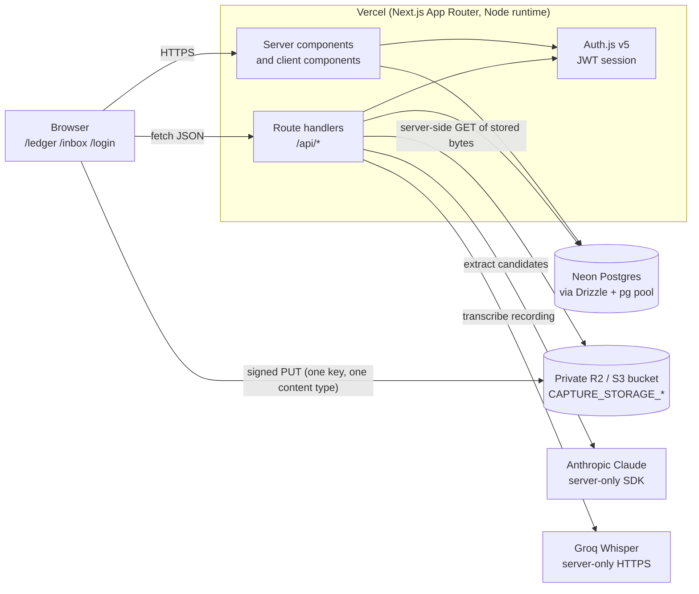
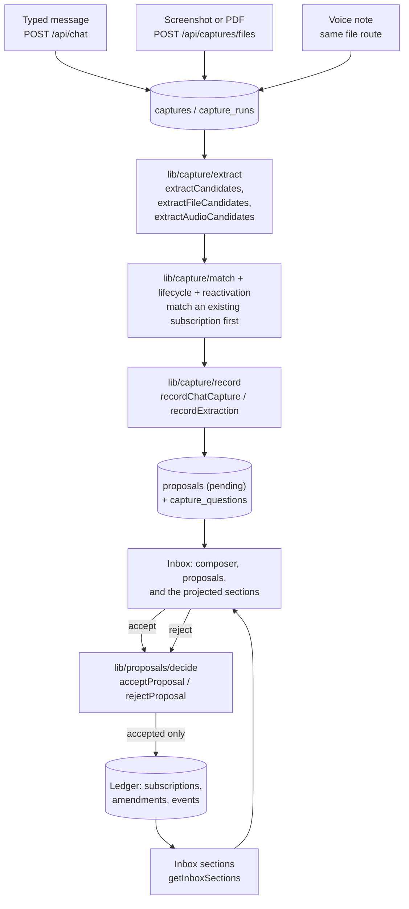
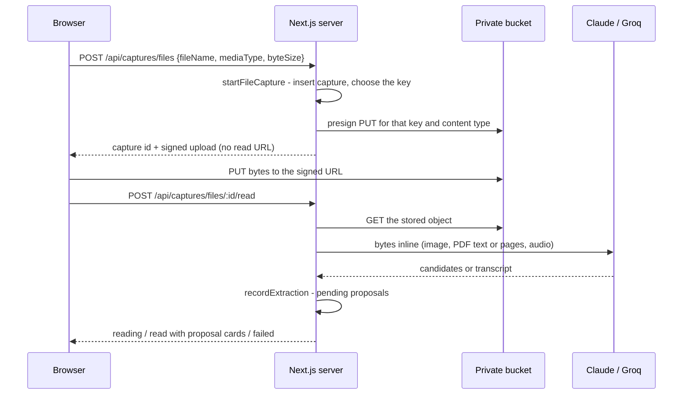
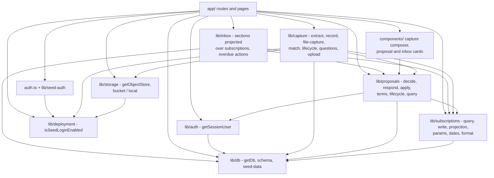

# System map (web-cloud)

How the shipped system is wired. This page is
descriptive: product rules live in [product.md](product.md) and
[AGENTS.md](../AGENTS.md), tables in [data-model.md](data-model.md), and it
does not restate them.

The product records **holdings, cost, and next due**, not payments. A receipt
updates those three; it is not a transaction to store. Capture does not write
payments. There is no `charges` table. List, detail, and the timeline do not
show charge lines. A `charged` proposal, if one is accepted, applies terms, not
a payment. Do not infer `cancelled` from silence or a passed `next_renewal`.
Keep the **stored** date until the user acts. **Do not replace it with a
projected future date.** A separate expected date may be computed
on read; it is never written back. There is no `lapsed` status. **No scan is
product behavior.** The intended system runs no unattended job against
`next_renewal`. Catch-up is an Inbox section, not a chat greeting. Inbox
reminder delivery (SUB-49) is also computed on read: no scheduler, no
notification store.

The lapse scan is gone: no job, route, Inngest function, or inbox button rolls
`next_renewal`, and list and detail return the stored date plus a labelled
expected-date field beside it when the row qualifies; it must not mutate the stored column.

Inbox is pending proposals, open capture questions, overdue holdings, unfinished
rows, and preference-driven Reminders (`lib/inbox/query.ts`, `GET /api/inbox`).
Questions are stored `asked`/`deferred` rows re-read through `loadOpenQuestions`.
The ledger sections store nothing of their own, and the ledger no longer
carries a Needs attention chip, filter, or count. Reminders replace the old
Renewing soon glance. There is no dismiss.

Overdue rows carry the two actions that replaced the lapse scan and the chat
greeting: **still have it** rolls the date by cadence as `inferred`, and
**cancelled** ends the row through the same lifecycle write an accepted
`cancelled` proposal uses. Confirmed auto-renewing active holdings leave
Overdue; the cancel action reviews the actual end date instead of silently
using the stored renewal date. Chat no longer asks anything on open.

**Nothing runs on a schedule.** There is no cron, no queue, and no Inngest: the
`reminders` table, the reminder scan, and the job client are all gone. A job
that writes money or dates is a second author of the ledger, and only the user
is. What the two scans used to persist is now projected on read. Stage-one
Inbox notifications stay in that model: compute eligibility when Inbox is
opened; refresh the page on focus and calendar-day change; write nothing when
a window expires.

Three things hold everything else together:

- The ledger UI is a **projection** of `subscriptions` + `amendments` +
  `events`, never a second source of truth.
- **Captures** (raw input) and **proposals** (suggestions) are separate stores.
  Nothing reaches the ledger until a proposal is accepted.
- Per `AGENTS.md`: "Do not auto-confirm `amount`, `cadence`, or
  `next_renewal`." Extraction writes `proposed` or `inferred` fields and
  pending proposals only; a user action is what sets `confirmed`. The same
  rule covers trial end and auto-renewal. Reminder instructions extracted from
  a capture remain proposals until accept.

## Runtime context



The browser never reads stored objects: uploads are signed for a write to one
key, and reads happen on the server, which passes the bytes to Claude or Groq
inline. Vendor keys exist only in the server environment.

## Capture → proposal → ledger



There is no edge from extraction to the ledger, and no edge into it from
anything unattended. A rejected proposal records the decision and leaves the
ledger alone. Answering an open capture question folds the reply into the
pending create that asked it; it does not insert a second card for the same
stub. Repeating a whole capture before accept is a separate identity issue.

### Signed upload, then read



## Internal modules

`app/` holds routes and UI; every rule and query lives in `lib/`. Route
handlers do three things: resolve the session user, parse the body with Zod, and
call one `lib/` entrypoint.

| Surface | `lib/` packages | Entrypoints |
|---|---|---|
| `/login`, `auth.ts` | `deployment`, `seed-auth` | `isSeedLoginEnabled`, `verifySeedCredentials` |
| `/ledger`, `/ledger/[id]` | `auth`, `db`, `subscriptions` | `getSessionUser`, `listSubscriptions`, `getSubscriptionDetail`, `timelineEntries`, `format` |
| `/ledger/new`, `/ledger/[id]/edit` | `subscriptions` | `toSubscriptionFormValues`, `parseCreateBody`, `parseUpdateBody` |
| `/inbox` | `capture`, `proposals`, `inbox` | the capture composer, `toProposalView`, `getInboxSections` |
| `GET /api/subscriptions`, `/summary`, `/:id` | `auth`, `db`, `subscriptions` | `parseListQuery`, `listSubscriptions`, `getSummary`, `getSubscriptionDetail` |
| `POST /api/subscriptions`, `PATCH /api/subscriptions/:id` | `auth`, `db`, `subscriptions` | `createSubscription`, `updateSubscription` |
| `POST /api/chat` | `auth`, `db`, `capture` | `extractCandidates`, `recordChatCapture`, `recordCancelTimingAnswer`, `recordIdentityAnswer`, `recordChatDeferral` |
| `POST /api/captures/files`, `/:id/read` | `auth`, `db`, `capture`, `storage` | `startFileCapture`, `readFileCapture`, `getObjectStore` |
| `PUT /api/captures/upload` | `auth`, `capture`, `storage` | `getObjectStore` (development disk store only) |
| `GET /api/proposals` | `auth`, `db`, `proposals` | `parseProposalQuery`, `listProposals` |
| `POST /api/proposals/:id/accept`, `/reject` | `proposals` | `respondToProposal` → `acceptProposal` / `rejectProposal` |
| `GET /api/inbox` | `auth`, `db`, `inbox` | `getInboxSections` |
| `POST /api/inbox/overdue/:id/still-holding`, `/cancel` | `auth`, `db`, `inbox` | `respondToOverdue` → `resolveOverdue` |

### Who imports whom



Direction is stable: `db` and `deployment` are leaves, `subscriptions` owns
ledger reads and writes, `proposals` is the only package that turns a pending
row into a ledger change, and `capture` produces proposals without ever writing
the ledger itself. `inbox` reads what the ledger already holds and — for the two
overdue actions only — writes through `proposals`.

### Modules added in stage one

All three have landed; the issues are the history.

| Module | Issue | Role |
|---|---|---|
| `lib/subscriptions/schedule.ts` | SUB-48 | Pure resolver: recorded date vs expected date, original-anchor recurrence. Shared by list/detail, sort/filter, summary next-upcoming, Inbox, reminder previews. Reads write nothing. |
| `lib/subscriptions/coverage.ts` | SUB-46 | Pure paid-commitment classifier: confirmed vs unconfirmed vs omitted vs after-trial. Summary totals use the same rounding as list rows. |
| `lib/reminders/notifications.ts` | SUB-49 | Inbox occurrence projection from preferences + schedule resolver. |

### Subscription Workspace UX direction

Agreed in [SUB-57](https://linear.app/lets-play-match/issue/SUB-57/publish-the-agreed-subscription-workspace-ux-contract)
([plan](subscription-workspace-ux-plan.md)); nothing below exists on `main`
yet — each part lands in its linked issue. The wiring rules above still hold:
reuse the existing capture/proposal/subscription/lifecycle writers, the
schedule resolver, and the reminder projections; add no second lifecycle or
notification path.

- Capture and question work repairs the existing pipeline in place:
  [SUB-54](https://linear.app/lets-play-match/issue/SUB-54/capturing-an-ordinary-onboarding-list-fails-with-an-unactionable-error)
  (length-related extraction failure — inspect the actual `stop_reason`),
  [SUB-55](https://linear.app/lets-play-match/issue/SUB-55/open-capture-questions-are-recorded-but-never-surfaced-again)
  (persisted questions are never reloaded into the UI; `loadOpenQuestions` is
  already the helper), [SUB-52](https://linear.app/lets-play-match/issue/SUB-52/decide-the-holding-identity-rule-for-capture)
  (identity: stable holding ID, provider/account as evidence, account-aware
  matching, no provider uniqueness), [SUB-56](https://linear.app/lets-play-match/issue/SUB-56/a-misread-provider-cannot-be-corrected-on-a-card-so-it-becomes-a-new)
  (retarget a misread provider on the card).
- A **persistent conversation** with explicit target IDs and unsent-draft
  recovery ([SUB-61](https://linear.app/lets-play-match/issue/SUB-61/keep-a-persistent-conversation-linked-to-the-selected-subscription-or))
  extends existing tables with minimal linkage. Targets resolve under the
  session user; cross-user and incompatible IDs are rejected. Transport retry
  idempotency is distinct from semantic duplicate matching, and proposal
  decisions keep revision checks for stale reviews.
- The shared responsive shell ([SUB-62](https://linear.app/lets-play-match/issue/SUB-62/bring-work-and-subscriptions-into-one-responsive-workspace))
  assembles the existing Inbox and ledger surfaces; it does not reimplement
  them. [SUB-65](https://linear.app/lets-play-match/issue/SUB-65/make-subscriptions-the-primary-workspace-with-contextual-reviews) made the subscription list the primary surface: the client
  joins `GET /api/subscriptions`, `GET /api/proposals?state=pending` and
  `GET /api/inbox` by stable holding id (`lib/workspace/subscription-list.ts`)
  and shows each row's reviews, questions and reminders inline, using the same
  card, question, reminder, terms and history components and the same write
  endpoints as before.

`lib/subscriptions/dates.ts` already has `shiftCalendarMonths` and
`rollNextRenewal`. Reminder start dates use that arithmetic from
`lib/reminders/dates.ts`. The expected-date resolver must use original-anchor
arithmetic (`shiftCalendarMonths(anchor, n)`), not `rollNextRenewal`. Manual
writes stay in `lib/subscriptions/write.ts`; lifecycle stays in
`lib/proposals/lifecycle.ts`. Do not add a second lifecycle implementation.

## Security

- Every `/api/*` route except the Auth.js handler resolves a session first;
  `user_id` comes from the session, never from a request body.
- Every ledger, proposal, capture, and inbox query filters by that
  `user_id`, and another user's row is a 404.
- Vendor keys and bucket credentials are server-only. The bucket is private and
  no read URL is ever minted for the browser.
- The development disk store writes under `.captures` (git-ignored, outside
  `public/`) and only under the caller's own key prefix.

## External dependencies

npm, from `package.json` (Node 20.19, 22.13, or newer LTS):

| Package | Used for |
|---|---|
| `next`, `react`, `react-dom` | App Router pages and route handlers |
| `next-auth` (Auth.js v5) | Session, credentials provider |
| `drizzle-orm`, `pg` | Queries and the Postgres pool |
| `zod` | Every request body, extractor tool output, and job payload |
| `@anthropic-ai/sdk` | Claude extraction from text, images, and PDFs |
| `@aws-sdk/client-s3`, `@aws-sdk/s3-request-presigner` | Signed PUTs and server-side reads of the R2/S3 bucket |
| `pdfjs-dist` | Reading a PDF's own text layer before sending pages |
| `tailwindcss`, `@tailwindcss/postcss`, `postcss` | Styling |
| `drizzle-kit`, `tsx`, `dotenv` | Migrations and the seed script |
| `vitest` | Unit and API tests |
| `eslint`, `eslint-config-next`, `typescript` | Lint and typecheck |

Groq's Whisper transcription is a plain `fetch` to
`https://api.groq.com/openai/v1/audio/transcriptions`; it has no SDK dependency.

Hosted services:

| Service | Role | Required for |
|---|---|---|
| Vercel | Hosts the app; `VERCEL_ENV` distinguishes preview from production | Deployment |
| Neon Postgres | The database behind `DATABASE_URL` | Everything |
| Anthropic Claude | Extraction from messages, screenshots, PDFs | Capture on `/inbox` |
| Groq Whisper | Transcribing voice notes | Voice notes |
| Cloudflare R2 or any S3-compatible bucket | Private storage for uploads | File and voice capture |

### Environment variable names

Names only, as in `.env.example`; no values belong in this repo.

| Variable | Read by |
|---|---|
| `AUTH_SECRET` | Auth.js session signing |
| `SEED_EMAIL`, `SEED_PASSWORD` | `lib/seed-auth`, `lib/db/seed.ts` |
| `DATABASE_URL` | `lib/db`, `drizzle.config.ts`, tests |
| `ANTHROPIC_API_KEY` | `lib/capture/extract` → `lib/capture/anthropic` |
| `GROQ_API_KEY`, `GROQ_TRANSCRIPTION_MODEL` | `lib/capture/transcribe` |
| `CAPTURE_STORAGE_BUCKET`, `CAPTURE_STORAGE_ENDPOINT`, `CAPTURE_STORAGE_REGION`, `CAPTURE_STORAGE_ACCESS_KEY_ID`, `CAPTURE_STORAGE_SECRET_ACCESS_KEY` | `lib/storage/objects` → `lib/storage/bucket` |

The code also reads `NODE_ENV` and `VERCEL_ENV` (`lib/deployment`), and an
optional `ANTHROPIC_MODEL` override documented in the root `README.md`.

### When a key is missing

A missing key never looks like a working product: the fallbacks exist for a
laptop, and a deployed server refuses instead.

| Missing | development / test | preview / production |
|---|---|---|
| `ANTHROPIC_API_KEY` | Labelled fixture extractor: pattern matching over the message, the file name, or a PDF's text layer, and every response says so | `503 extractor_unavailable` from `/api/chat` and the file read, with a message naming the key |
| `GROQ_API_KEY` | No stand-in — a recording cannot be read without listening to it, so the read fails saying the key is missing | Same failure, worded for a server |
| `CAPTURE_STORAGE_*` | Disk store under `.captures`, uploaded through `PUT /api/captures/upload` | `503 storage_unavailable` rather than storing receipts somewhere less private |
| `DATABASE_URL` | `getDb()` throws; the API tests skip themselves | The app cannot serve |

### When a reading fails

A capture that fails says which of three things happened, because the person
holding the list can only act on one of them. `lib/capture/anthropic` reads
`message.stop_reason` before it reads what the model said, and logs one line per
reading with the measured `output_tokens`, so the budget stays sized from real
captures rather than from an estimate.

| What happened | What the sender sees |
|---|---|
| `stop_reason` is `max_tokens` — the reply ran out of room | The list was too long to read in one go; send it in smaller batches. Nothing is saved and the message stays in the box |
| No tool call, or candidates the schema rejects | The reply could not be read; send it again. The schema complaint goes to the log, never to the sender |
| A tool call with an empty list | Not a failure: the message named no subscription, and the composer says so |

`MAX_TOKENS` is derived from `MAX_CANDIDATES`, so the budget always covers the
largest reply the tool advertises — 25 candidates each carrying a full-length
`evidence` span. A reading that comes back at the cap carries a notice naming
it, so a longer list is never quietly shortened. See
[SUB-54](https://linear.app/lets-play-match/issue/SUB-54/capturing-an-ordinary-onboarding-list-fails-with-an-unactionable-error).

## Environments

| | local `development` | test | Preview (Vercel) | Production (Vercel) |
|---|---|---|---|---|
| `NODE_ENV` / `VERCEL_ENV` | `development` / unset | `test` / unset | `production` / `preview` | `production` / `production` |
| Auth | Seed credentials (`SEED_EMAIL`, `SEED_PASSWORD`) | Seed user rows, no browser session | Seed credentials — this is what a human signs in with per PR | Magic-link placeholder; seed login is off |
| Database | `DATABASE_URL` — the Neon `dev` branch, **seeded**. Yours to break; re-branch from `template` when it drifts. This is the one you click through with `npm run dev` | **Never** `DATABASE_URL`. An ephemeral `postgres:16` (`docker-compose.yml`, port 5433) locally, CI's service container, or the sandbox's Postgres in a cloud session. Migrated, **never seeded**, discarded after the run; each API test also runs in a transaction that is rolled back | **Its own Neon branch**, forked from the empty `template` per pull request by the Neon Postgres Previews integration and deleted when the branch goes. `scripts/build.sh` migrates and seeds it, so each PR is signed off against its own data and never against production's | The Neon `production` branch, migrated by `scripts/build.sh` when `main` deploys; **never seeded** — this is the real inventory |
| Storage | Bucket if `CAPTURE_STORAGE_*` is set, otherwise `.captures` on disk | No object store is touched; stores are stubbed | Private bucket or `503` | Private bucket |
| Anthropic | Key if you have one, otherwise labelled fixtures | No key; fixtures do the reading | Key required, or capture returns `503` | Key required |
| Groq | Key required to read a voice note | Transcription is stubbed | Key required | Key required |
| Checks | `npm run lint`, `npm run typecheck`, `npm test`, `npm run build`. `pretest` starts and migrates the test container first | GitHub Actions runs lint, typecheck, `db:migrate`, then `npm test` on every PR and on `main`; `pretest` is a no-op there because `CI` is set | — | — |

### How a preview gets its connection string

The Neon-managed Vercel integration does not set `DATABASE_URL` on Vercel's
**Preview** environment. It creates **git-branch-scoped** variables — one
`DATABASE_URL` and `DATABASE_URL_UNPOOLED` per branch, shown in Vercel against
the branch name rather than against "Preview". So there is no single Preview
value that every deployment shares, and no shadowing between branches.

Vercel's **Development** environment variables, and the `vercel-dev` Neon branch,
come from the same integration and are unrelated to the `dev` branch used by
`npm run dev`. `npm run dev` reads `.env.local`; it never consults Vercel.

Production is the exception: its `DATABASE_URL` is set by hand, and the app needs
it at runtime (`lib/db/index.ts`), not just at build time.

### Resetting a branch

`drizzle-kit migrate` records what it has applied in **`drizzle.__drizzle_migrations`**
— a different schema from the tables it creates. So a wipe must drop both, or the
journal outlives the tables, drizzle concludes every migration is already applied,
and `npm run db:migrate` **reports success while doing nothing**:

```sql
DROP SCHEMA IF EXISTS public CASCADE;
DROP SCHEMA IF EXISTS drizzle CASCADE;
CREATE SCHEMA public;
```

Dropping only `public` leaves a branch that builds cleanly and then fails every
request on missing tables — and because previews are forked from `template`,
a `template` in that state poisons every preview made from it.

`scripts/build.sh` therefore does not trust the migrator's exit code. It checks
for `public.users` afterwards and fails the build if the table is missing.

### Neon branch topology

```text
template  ← the project's DEFAULT branch. Empty. Nothing ever writes to it.
├── production   real inventory. Parent of nothing.
├── dev          your `npm run dev`. Seeded.
└── preview/<git-branch>   one per pull request, deleted with the branch
```

The default branch is a deliberately empty `template`, not `production`.

Neon's Vercel integration always forks preview branches from the project's
**default** branch and that is not configurable, so whatever is default gets
copied into every preview. If `production` were default, every preview and every
`dev` branch would be a copy-on-write fork of a real subscription inventory —
real providers, amounts and renewal dates in throwaway environments — and it
would drift as production is used.

Making `template` the default inverts that. `production` becomes a leaf: nothing
is ever forked from it. `template` is written to by nothing, so it cannot drift,
and every preview starts from the same empty state. Any branch can be made
default in Neon (`neonctl branches set-default`), so `production` does not have
to be.

Previews therefore build their data rather than inherit it: `scripts/build.sh`
migrates the fresh branch from empty and seeds it. Deterministic, and no
production row is ever copied anywhere.

### Where each deployment's database comes from

`"build": "bash scripts/build.sh"`. Locally that is `next build` and nothing
else — a local build never touches a database. On Vercel it first migrates the
deployment's own database, then seeds it **only** when `VERCEL_ENV=preview`.

A preview's Neon branch is forked from the empty `template`, so it arrives with
no schema at all — and certainly not the pull request's own migration. Running
the migration in the build is what makes a preview exist, and what makes a
schema-changing PR previewable.

Migrations use `DATABASE_URL_UNPOOLED` when it is set. Neon's integration points
`DATABASE_URL` at the pooler, and DDL through a pooler misbehaves.

Seeding runs on every preview deploy and **truncates first**, so a preview looks
identical on every deploy no matter what a reviewer did to it. Pushing a fix
mid-review resets anything you clicked, which is the point: sign-off should be
repeatable.

Upserting alone was not enough. It restored the seeded rows but left anything a
reviewer created in place for the life of the branch, and never touched
`captures`, `capture_runs` or `capture_questions` at all — so a
reviewer's captures could permanently suppress questions the next reviewer needed to
see. `npm run db:seed` therefore refuses to run when `VERCEL_ENV=production`.

### Why the test database is separate

The integration suites insert their own fixtures using the same fixed ids as
`lib/db/seed-data.ts` (`SEED_USER_ID`, `SEED_SUBSCRIPTION_IDS`). Against a
seeded database each `beforeAll` dies on `users_pkey`, so Vitest reports those
files as **skipped** and `npm test` still exits 0 — a green run that asserted
nothing. `vitest.global-setup.ts` now refuses to start on a seeded database
rather than letting that happen quietly.

The suite therefore chooses its own database and ignores `DATABASE_URL` on a
laptop. Precedence, implemented identically in `vitest.config.ts` and
`scripts/test-db.sh`: `TEST_DATABASE_URL` if set; otherwise `DATABASE_URL` when
`CI` or `CLAUDE_CODE_REMOTE` is set, because those supply their own migrated,
unseeded database; otherwise the Docker container.

Preview is what a human tests per PR, which is why seed login and the scan
buttons exist there and only there. Production is one person's inventory, so
nothing seeds it and no development stand-in runs. Tests use Vitest and must
not need a live vendor key: the extractor, the transcriber, and the object
store are all injectable, and the only external thing a test wants is Postgres.

## Everything is in the request

| In the request | On a schedule |
|---|---|
| Session, list, detail, summary, manual create and edit, capture extraction, file and voice reads, accept and reject, the two overdue actions, Inbox section projection including Reminders | Nothing |

There is no scheduled work at all, so nothing touches `next_renewal` between
visits. A holding row's stored past date stays stored. After SUB-48 an
expected date may be computed for display; it is not written. After SUB-49 a
reminder window that has closed simply fails the on-read predicate.

File reads run in-request rather than as a job, and `capture_runs` carries the
state (`reading`, `read`, `failed`) the composer polls, with a takeover window
so a run abandoned mid-read can be retried.
