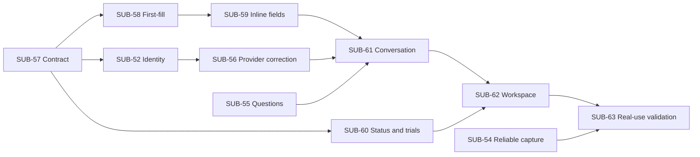

# Subscription Workspace UX — agreed contract

Agreed 10 September 2026; published into the repository in
[SUB-57](https://linear.app/lets-play-match/issue/SUB-57/publish-the-agreed-subscription-workspace-ux-contract)
(docs only — this PR implements nothing). Source of record: the
[agreed plan and acceptance journeys](https://linear.app/lets-play-match/document/subscription-workspace-ux-agreed-plan-and-acceptance-journeys-d312a6570e4c)
in Linear. Human journeys live in
[subscription-workspace-ux-acceptance-journeys.md](subscription-workspace-ux-acceptance-journeys.md).

Stage One is complete — every delivery issue (SUB-42–SUB-53) is Done, and
[Stage One](https://linear.app/lets-play-match/project/stage-one-e9ded9c215f5/overview)
is retained as history. Its unresolved findings carry into this project with
their existing issue IDs; closing Stage One did not fix them.

This file is the contract the dependent issues implement. Until a linked issue
ships, `main` keeps its current behaviour — these rules are **agreed**, not yet
live. Do not treat anything here as implemented or as evidence of a new live
sign-off, and do not implement a forthcoming rule inside a different issue's PR.

## Finish line

“I can paste my subscriptions, correct an interpretation, answer a question
later and see the right record updated — without wondering where to go next.”

Stage One delivered the ledger, trust, schedules and reminders. This project
completes the everyday interaction loop: capture → review interpretation →
accept → see the updated record.

## Product shape

- One shared shell. *Superseded by [SUB-65](https://linear.app/lets-play-match/issue/SUB-65/make-subscriptions-the-primary-workspace-with-contextual-reviews):* the shell first shipped
  with **Work** and **Subscriptions** views; it is now one list of
  subscriptions — saved records and drafts not yet added — under four
  overlapping filters: **All**, **Pending reviews**, **Open questions**,
  **Reminders**. What Work covered (pending proposals, open and deferred
  questions, reconciliation, preference-driven reminders) is shown on the
  subscription or draft it is about, not in a separate destination. Filters
  are lenses over the same rows, not lifecycle statuses, and counts are rows.
  Aggregate totals and coverage do not appear on this surface. The approved
  reference is `docs/prototypes/sub-65/`.
- One composer for text, lists, screenshots/PDFs and voice. It visibly
  identifies its target: **All subscriptions**, **About a selected
  subscription**, or **Replying to a particular question**.
- A subscription or draft opens inline, one at a time, with its review,
  question or reminder first, then current terms, then evidence and history
  behind disclosure. The conversation about it sits beside the details on
  desktop and below them on narrow screens; the unsent draft survives
  opening another row and coming back.
- Persistent conversation and explicit target IDs. A short answer such as
  “£12 monthly” belongs to the selected price question, not whichever question
  was most recently asked globally.
- Show one useful next question prominently while keeping every other open
  question reachable. Deferral does not delete a question and is separate from
  non-dismissible reminder cards.
- Reuse the same review and field controls across the current pages and the
  future workspace. Improve the current interactions before the shared shell
  lands.
- The list opens on All, which is saved inventory only; drafts appear under
  Pending reviews marked **Not added yet**. Status filters, search and sort
  remain. Save incomplete subscriptions without inventing missing cost or
  dates; unknown values are never shown as zero.

## Status and trials — agreed

This is subscription record management, not a collection of services the user
might explore. Adding a subscription supplies holding context.

| Input | Interpretation for acceptance |
|---|---|
| “ChatGPT subscription is £10 per month” | Active, with price/cadence independently reviewable |
| A pasted list of subscription names | Active for each new subscription |
| “These are my trial subscriptions…” | Trial, even when trial ends are unknown |
| “My ChatGPT subscription trial ends on 10 October; after that it is £12.99 per month”, stated before 10 October | Current Trial; the monthly price is after trial |

- New subscriptions default to **Active** unless the input indicates trial,
  pause, cancellation or another state. `unknown` status is for genuinely
  ambiguous or contradictory input — a missing price or date is **not** an
  unknown holding.
- Interpret fresh current-trial statements using tense and date context. Do
  not ask the user to repeat that they are on a trial.
- Capture still creates **pending proposals only**. The card displays an
  editable status; acceptance establishes that displayed status without a
  second status-confirmation question.
- Money, currency/cadence, renewal and trial-end dates, and auto-renewal
  retain their separate confirmation scope. Status acceptance does not
  confirm them.
- Existing records retain context. A price-only update does not reset a
  `trial` or `cancelled` record to `active`. A fresh statement supporting a
  change may propose it through the existing conflict/lifecycle rules.
- A trial-end field already stored on a record is weaker evidence than a
  fresh current-trial statement. Do not infer current status from that stored
  date alone, and do not bulk-reclassify legacy rows.
- A direct **Set active** action on a genuinely unresolved record changes
  status only. Do not reuse **Still have it**, which can also roll the
  recorded renewal date.
- Trial price/cadence means the paid plan after trial, excluded from current
  paid commitments. Never invent a confirmed zero. Trial end is distinct from
  recorded renewal and from subscription end.
- Time passing does not turn `trial` into `active`. A report that paid
  service began keeps the same holding identity; lifecycle changes use the
  shared writers and user-specified timing.

The earlier mockup showed recovery for legacy `unknown` records. It does not
demonstrate this newly agreed default for fresh captures.

## Precise field review

- Confirming one value means exactly that value. An amount-only button must
  not fill confirmation flags for unrelated dates, cadence or auto-renewal.
- Prefill editing controls with current values; opening or saving an
  unchanged form is not confirmation.
- Show a reviewable field selection for explicit multi-field confirmation.
  Keep **Accept** distinct from confirming extracted terms; labels should
  make the status/terms distinction clear.
- Provider/plan/account correction, or choosing an existing holding,
  retargets or recomputes the draft without confirming money or dates.
- Filling an empty amount/cadence/plan is ordinary completion, not
  automatically a terms change. Notes-only edits send only notes.
- For replacement of known terms, show old → new and distinguish correcting
  the record from an actual price/plan change. A terms change needs the
  user's effective date. The explicit change action remains available when
  old terms were never recorded.
- Mixed edits can complete one field and change another; preserve unrelated
  history and trust. Trial after-trial terms retain the ordinary-edit rule.

## Holding identity direction

Endorsed here so [SUB-52](https://linear.app/lets-play-match/issue/SUB-52/decide-the-holding-identity-rule-for-capture)
implements one rule rather than re-deciding it.

- **The stable holding ID is identity.** Provider and account are matching
  evidence; plan is an editable property. Do not make provider or
  provider+account globally unique.
- An explicit selected target wins when it is session-owned and compatible
  with the message; contradictory context requires review.
- One compatible provider/account match can receive a visible update
  proposal. Multiple matches with no distinguishing account require a choice;
  never pick the first or only active row silently.
- A named account reaches its unique compatible holding. A different or
  previously unseen account requires clarification between another holding
  and changed account details — it must not silently overwrite.
- Provider+plan names and voice misspellings should expose likely matches and
  an explicit separate-subscription option. No blanket removal of “Pro”.
- A repeated equivalent pending input links or reuses the same intended draft
  while preserving evidence. Conflicting evidence stays reviewable; distinct
  holdings are never silently dropped or merged.
- Acceptance rechecks identity and revision transactionally. A stale review
  cannot silently retarget, overwrite confirmed facts, or create a duplicate.
- Question identity is scoped to the holding or draft, not only
  user+provider+reason, so separate accounts do not overwrite each other's
  questions.
- “Use existing” retargets a pending proposal; it does not merge or delete
  already-created holding identities.

## Delivery and dependencies

Milestones group outcomes, not strict sequential gates; issue blockers define
execution order. See each issue for live state.

| Issue | Scope | Milestone | Direct blockers |
|---|---|---|---|
| [SUB-57](https://linear.app/lets-play-match/issue/SUB-57/publish-the-agreed-subscription-workspace-ux-contract) | Publish this contract | 1 | — |
| [SUB-54](https://linear.app/lets-play-match/issue/SUB-54/capturing-an-ordinary-onboarding-list-fails-with-an-unactionable-error) | Reliable list capture | 1 | — |
| [SUB-52](https://linear.app/lets-play-match/issue/SUB-52/decide-the-holding-identity-rule-for-capture) | Holding identity rule for capture | 1 | SUB-57 |
| [SUB-56](https://linear.app/lets-play-match/issue/SUB-56/a-misread-provider-cannot-be-corrected-on-a-card-so-it-becomes-a-new) | Correct a misread provider on a card | 1 | SUB-52 |
| [SUB-55](https://linear.app/lets-play-match/issue/SUB-55/open-capture-questions-are-recorded-but-never-surfaced-again) | Surface open capture questions again | 2 | — |
| [SUB-58](https://linear.app/lets-play-match/issue/SUB-58/add-missing-subscription-terms-without-a-terms-change-question) | First-fill without a terms-change question | 2 | SUB-57 |
| [SUB-59](https://linear.app/lets-play-match/issue/SUB-59/confirm-and-edit-individual-fields-directly-on-proposals-and-records) | Per-field confirm and edit on proposals and records | 2 | SUB-57, SUB-58 |
| [SUB-60](https://linear.app/lets-play-match/issue/SUB-60/interpret-new-subscriptions-as-active-and-current-trials-as-trial) | Active default and current-trial interpretation | 2 | SUB-57 |
| [SUB-61](https://linear.app/lets-play-match/issue/SUB-61/keep-a-persistent-conversation-linked-to-the-selected-subscription-or) | Persistent conversation linked to the selected subscription or proposal | 3 | SUB-59, SUB-55, SUB-56 |
| [SUB-62](https://linear.app/lets-play-match/issue/SUB-62/bring-work-and-subscriptions-into-one-responsive-workspace) | One responsive Work/Subscriptions workspace | 3 | SUB-61, SUB-60 |
| [SUB-65](https://linear.app/lets-play-match/issue/SUB-65/make-subscriptions-the-primary-workspace-with-contextual-reviews) | Subscriptions as the primary workspace; contextual reviews, questions and reminders | 3 | SUB-62 |
| [SUB-63](https://linear.app/lets-play-match/issue/SUB-63/validate-the-subscription-workspace-with-real-onboarding-and-return) | Real onboarding and return validation | 4 | SUB-62, SUB-65, SUB-54 |

Review lanes remain useful even before the whole shell exists: SUB-54 fixes
capture, SUB-55 makes current questions answerable, and the field/status work
improves the current pages. The shared shell assembles these behaviours rather
than reimplementing them.

## Implementation boundaries

Use the existing Next.js/React/TypeScript, Postgres/Drizzle, Zod and
server-only extraction stack. Reuse the existing capture/proposal/
subscription/lifecycle writers, schedule resolution and reminder projections.
Extend existing tables with minimal conversation linkage only where necessary.

All targets are resolved under the session user. Reject cross-user and
incompatible IDs. Distinguish transport retry idempotency from semantic
duplicate matching. Use revision checks for stale proposal decisions.

One issue per PR, on the repository's branch and PR conventions, with a
written human test plan. Issues stay **In Progress** after the PR opens until
Bhavesh signs off; no agent merges.

No new login/auth setup, payments ledger, vendor pricing source of truth,
external notifications, scheduler, notification store, reminder
dismiss/snooze/read-to-clear, or automatic lifecycle conversion. Stored dates
remain separate from labelled expected dates.

## Evidence and carry-forward

Source review: local `main` at `99bad9a` on 9 September, the Stage One
issues, supplied notes/screenshots and the representative journey tests. The
review was not a new live reproduction.

- [SUB-54](https://linear.app/lets-play-match/issue/SUB-54/capturing-an-ordinary-onboarding-list-fails-with-an-unactionable-error):
  length-related extraction failure; inspect the actual `stop_reason` to
  distinguish truncation from malformed output.
- [SUB-55](https://linear.app/lets-play-match/issue/SUB-55/open-capture-questions-are-recorded-but-never-surfaced-again):
  questions are persisted but not reloaded into the UI. The helper is
  `loadOpenQuestions`, used internally; the original dead-code claim was
  inaccurate.
- [SUB-52](https://linear.app/lets-play-match/issue/SUB-52/decide-the-holding-identity-rule-for-capture)
  / [SUB-56](https://linear.app/lets-play-match/issue/SUB-56/a-misread-provider-cannot-be-corrected-on-a-card-so-it-becomes-a-new):
  provider-only matching and uncorrectable identity, including pending
  duplicates and separate accounts. Both reproducers stay pinned in
  `lib/journeys/identity.integration.test.ts` until the rule ships.
- Capture already supports status proposals. The required change is
  interpretation/defaults and clear acceptance, not building status storage
  from scratch.
